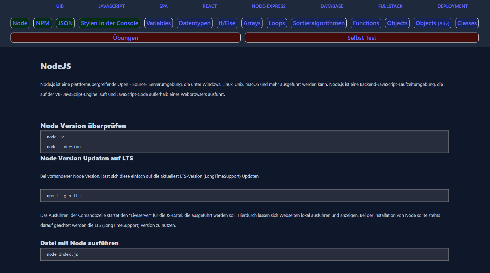

<h1 align="center">Nice to See you!</h1>

I’m currently working at an institute as a Web Development Teacher. My role involves teaching students various aspects of web technologies, including HTML, CSS, JavaScript, and frameworks like React.

I am passionate about sharing knowledge and helping students build a strong foundation in web development.

<h2 align="center">My Projects</h2>

<h2 align="center">My Tech Stack and Tools I Use</h2>

  
  
  
  
  
  
  
  
  

  
  
  
  
  
  
  
  
  

  
  
  
  
  

  
  
  

###

  
  
  

###
